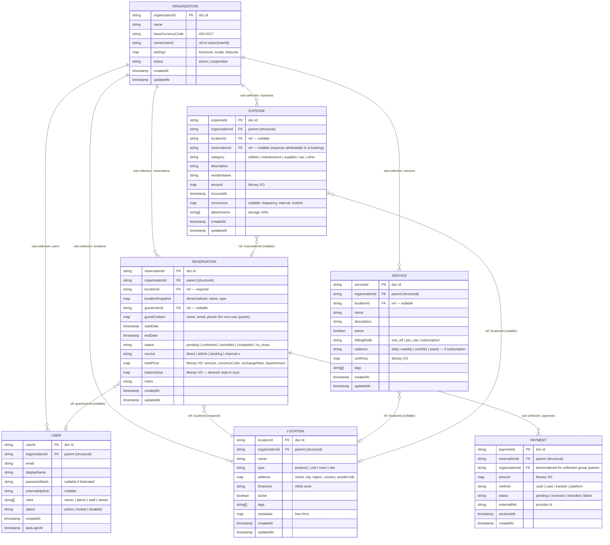

# Phase 1 — ERD & Domain Modeling (Firestore NoSQL)

> **Status:** Delivered, awaiting feedback.
> **Paradigm:** Document / Collection / Sub-collection model. The term "ERD" is used loosely — what follows is a **document model** with explicit reference fields, not a relational schema.

---

## 1. Modeling Principles for Firestore

Firestore has no joins and no foreign keys. We compensate with:

| Principle | How we apply it here |
|---|---|
| **Tenant = top-level document** | `organizations/{organizationId}` is the tenant root. All tenant-owned data lives under it as sub-collections. This makes tenant isolation structural — every query *must* walk through `organizations/{organizationId}/...`. |
| **References, not FKs** | Cross-document links are stored as `{ id: string, path?: string }` pairs. We store the ID and (optionally) the full path for faster reads. |
| **Strategic denormalization** | High-read, low-change fields (e.g. `location.name`) are copied onto referencing docs (e.g. `reservation.locationSnapshot`) to avoid N+1 reads. Writes must update the copy. |
| **Embedded value objects** | `Money`, `Address`, `DateRange` are stored as maps inside the parent document — they have no independent lifecycle. |
| **Sub-collection only when 1:N and queried-with-parent** | `reservations/{id}/payments` is a sub-collection because payments are only ever read in the context of their reservation. `reservations` itself is *not* nested under `locations` because we often query across locations (e.g. "all upcoming reservations for the org"). |
| **Queries drive schema** | Every access pattern below drives a composite index declaration (tracked in `firestore.indexes.json` in a later phase). |

---

## 2. High-Level Document Model (Mermaid)



---

## 3. Firestore Path Layout (canonical)

```
organizations/{organizationId}
│  • Organization document
│
├─ users/{userId}
│  • User document (roles scoped to this organization)
│
├─ locations/{locationId}
│  • Location document (property, unit, room, site)
│
├─ reservations/{reservationId}
│  │  • Reservation document
│  │
│  └─ payments/{paymentId}
│     • Payment document (only read in the context of a reservation)
│
├─ services/{serviceId}
│  • Service document (locationId is optional)
│
└─ expenses/{expenseId}
   • Expense document (locationId AND reservationId are both optional)
```

### Why these are sub-collections (not top-level)

- **Tenant isolation is structural.** There is literally no path to another organization's data from a scoped query.
- **Security rules (future)** become trivial: `match /organizations/{orgId}/{document=**}` + role check.
- **Backups / exports / deletes** per tenant are a single sub-tree operation.

### Why `payments` is nested under `reservations`

- Payments are *always* read with their parent reservation — there is no "list all payments" screen that doesn't start from a reservation. When the finance dashboard needs cross-reservation totals, we use a **collection-group query** on `payments` filtered by `organizationId` (hence the denormalized field on each payment doc).

### Why `users` is nested under `organizations`

- A `User` represents membership in *one* organization. If we later need "one human, many orgs", we'll introduce a top-level `identities/{sub}` collection that aggregates memberships — but today's scope is explicitly per-tenant.

---

## 4. Entity Explanations

### 4.1 Organization (tenant root)
The bounded context that owns every other document. `baseCurrencyCode` defines the currency in which `Money.baseAmount` is denominated across the org. `settings` is an open map for feature flags, timezone, locale, etc.

### 4.2 User
Authenticates against this org. Roles are a string array (`owner`, `admin`, `staff`, `viewer`) — permissions are derived server-side from roles. `passwordHash` OR `externalIdpSub` is set (future IdP federation). `User` has no payment or financial state of its own — it's the actor.

### 4.3 Location
Represents a property, unit, room, or site — the `type` field keeps this generic (SaaS-ready). Address is embedded because it's only read in context. `timezone` matters for scheduling and is always set explicitly (no implicit fallback).

### 4.4 Reservation
The core booking aggregate. Always references a `locationId`, optionally a `guestUserId` (in-house guest) *or* a `guestContact` map (walk-in / channel guest with no user record). `status` is a state machine transitioned only through Application Services. `totalPrice` and `balanceDue` are `Money` VOs; `balanceDue` is kept in sync by the Payment aggregate.

### 4.5 Payment (sub-collection of Reservation)
Atomic cash event against a reservation. `externalRef` links to the payment-processor ID. Status machine: `pending → received | failed`, with `refunded` as a terminal branch off `received`. `organizationId` is denormalized to enable collection-group queries (`collectionGroup('payments').where('organizationId','==',orgId)`).

### 4.6 Service
A billable or trackable service (cleaning, maintenance SLA, equipment rental, concierge fee). `locationId` is nullable — e.g. "org-wide consulting retainer". `billingMode` controls how line items are produced when a service is consumed. `cadence` only applies to `subscription` mode.

### 4.7 Expense
A cost to the organization. `locationId` is nullable (e.g. accountant fees, org-level software). `reservationId` is nullable (e.g. a maintenance cost attributed to a specific booking). `recurrence` describes recurring expenses (rent, utilities) and is expanded into concrete Expense docs by a scheduled job in a future phase.

### 4.8 Money (embedded value object)
Always four fields together: `{ amount: number, currencyCode: string, exchangeRate: number, baseAmount: number }`. Amounts are **integers in minor units** (cents) to avoid floating-point drift. `baseAmount` is `amount × exchangeRate`, rounded at write time, and is the field used for cross-reservation aggregates. `exchangeRate` is client-supplied in v1.

---

## 5. Access Patterns → Required Composite Indexes

| # | Use case | Path & filter | Index |
|---|----------|---------------|-------|
| 1 | List upcoming reservations for an org | `organizations/{org}/reservations` where `status in ['pending','confirmed']` orderBy `startDate` asc | `status, startDate` |
| 2 | Reservations for a location in a date range | `organizations/{org}/reservations` where `locationId == X && startDate >= A && startDate <= B` | `locationId, startDate` |
| 3 | Reservations by source (channel reporting) | `organizations/{org}/reservations` where `source == X` orderBy `startDate` desc | `source, startDate` |
| 4 | Expenses for a location by date | `organizations/{org}/expenses` where `locationId == X` orderBy `incurredAt` desc | `locationId, incurredAt` |
| 5 | Unassigned expenses | `organizations/{org}/expenses` where `locationId == null` orderBy `incurredAt` desc | `locationId, incurredAt` |
| 6 | Active services by cadence | `organizations/{org}/services` where `active == true && billingMode == 'subscription'` | `active, billingMode` |
| 7 | All payments for the org (finance dashboard) | `collectionGroup('payments')` where `organizationId == X` orderBy `receivedAt` desc | collection-group: `organizationId, receivedAt` |
| 8 | Reservations by guest | `organizations/{org}/reservations` where `guestUserId == X` orderBy `startDate` desc | `guestUserId, startDate` |

These will be materialized in `apps/rental-backend/firestore.indexes.json` during Phase 3.

---

## 6. Invariants Enforced by the Domain (not by Firestore)

Firestore has no schema or constraints, so **every invariant below is enforced in the Application / Domain layer:**

1. A `Reservation`'s `endDate` must be strictly after `startDate`.
2. A `Reservation` cannot transition from `cancelled` or `completed` to any active status.
3. `Money.currencyCode` must be a valid ISO-4217 uppercase code (regex `^[A-Z]{3}$`).
4. `Money.amount` and `Money.baseAmount` are non-negative integers.
5. If `Payment.status == 'received'`, the parent Reservation's `balanceDue` must be decremented in the same transaction.
6. Deleting a `Location` with any non-cancelled future `Reservation` is forbidden (Conflict).
7. A `Service` with `billingMode == 'subscription'` MUST have a non-null `cadence`.
8. An `Expense` may omit both `locationId` and `reservationId` (org-level cost), but not set `reservationId` without `locationId` — a booking-level expense inherits the reservation's location, so it must resolve to one.
9. All cross-document mutations that touch a reservation's `balanceDue` happen inside `FirestoreService.runTransaction`.

Violations throw typed `DomainError` subclasses — see `ARCHITECTURE.md §4.5`.

---

## 7. Questions for You Before Phase 2

1. **Reservation source enum** — is `['direct','airbnb','booking','channel-x']` sufficient, or should this be an open string with a separate admin-managed taxonomy?
2. **User model across orgs** — confirming users are strictly per-org for v1 (no shared identity). OK to revisit later?
3. **Recurrence model for expenses** — should recurring expenses be modeled as a `recurrence` map on a single template doc (as above), or as a separate `expense_templates` collection that expands into dated `expense` docs by a scheduler? I've chosen the former for simplicity; confirm or overrule.
4. **Payments as sub-collection** — OK to keep payments under reservations, given the collection-group workaround for org-wide queries? Or do you prefer a top-level `organizations/{org}/payments` collection?
5. **`balanceDue`** — do you want this computed and persisted (as modeled) or computed on read from the payments sub-collection? Persisted is faster but requires transactional updates.
6. **Expense categories** — should categories be a fixed enum on the domain side, or a tenant-configurable lookup (future `organizations/{org}/expense_categories/{id}`)?

Once confirmed, Phase 2 will implement the `packages/rental-entities` package with class-validator DTOs, branded ID types, and repository-port interfaces that mirror this model exactly.
